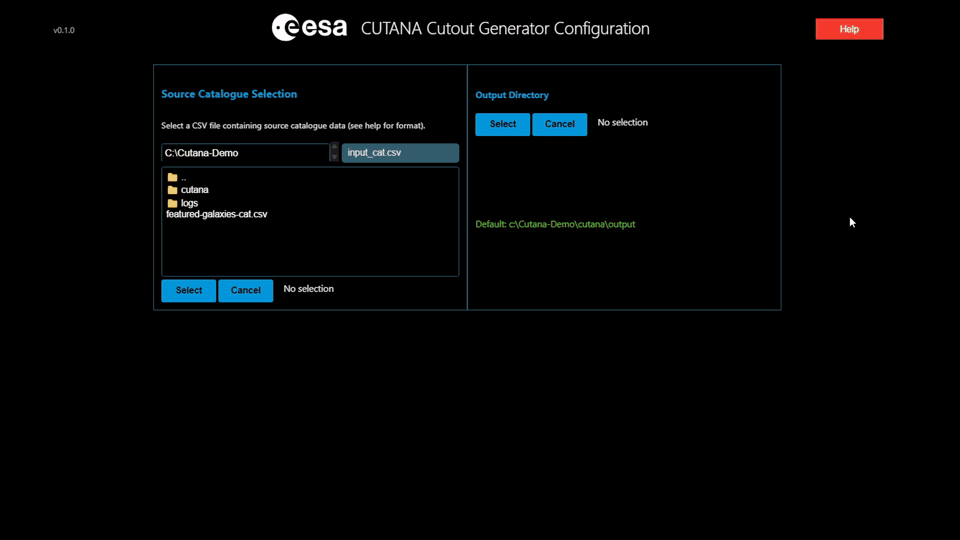

[//]: # (Copyright © European Space Agency, 2025.)
[//]: # ()
[//]: # (This file is subject to the terms and conditions defined in file 'LICENCE.txt', which)
[//]: # (is part of this source code package. No part of the package, including)
[//]: # (this file, may be copied, modified, propagated, or distributed except according to)
[//]: # (the terms contained in the file 'LICENCE.txt'.)
# Cutana - Astronomical Cutout Pipeline

[](https://pypi.org/project/cutana/)
[](https://pypi.org/project/cutana/)
[](https://doi.org/10.48550/arXiv.2511.04429)
[](LICENSE.txt)
[](https://pypi.org/project/cutana/)
[](CONTRIBUTING.md)

**Cutana** is a high-performance Python pipeline for creating astronomical image cutouts from large FITS datasets. It provides both an interactive **Jupyter-based UI** and a **programmatic API** for efficient processing of astronomical survey data like ESA Euclid observations.

**Documentation:** https://esa.github.io/Cutana/



> **Note:** Cutana is currently optimised for **Euclid Q1/IDR1 data**. Some defaults and assumptions are Euclid-specific:
> - Flux conversion expects the `MAGZERO` header keyword (configurable via `config.flux_conversion_keywords.AB_zeropoint`) to convert to Jy
> - Filter detection patterns are tuned for Euclid bands (VIS, NIR-Y, NIR-H, NIR-J)
> - FITS structure assumes one file per channel/filter
>
> For other surveys, you may need to adjust these settings or disable flux conversion (`config.apply_flux_conversion = False`).

## Support for Datalabs Users

For users experiencing problems with Cutana in the ESA Datalabs environment, please open a service desk ticket at: https://support.cosmos.esa.int/situ-service-desk/servicedesk/customer/portal/5

## Quick Start
### Installation

```bash
pip install cutana
```

Or for development:
```bash
# Create conda environment
conda env create -f environment.yml
conda activate cutana
```

### Interactive UI (Recommended)
For most users, the interactive interface provides the easiest way to process astronomical data:

```python
import cutana_ui

cutana_ui.start()  # optionally can specify e.g. ui_scale=0.6 for smaller UI
```

This launches a step-by-step interface where you can:
1. **Select your source catalogue** (CSV format)
2. **Configure processing parameters** (image extensions, output format, resolution)  
3. **Monitor progress** with live previews and status updates

### Programmatic API
For automated workflows or integration into larger systems:

```python
import pandas as pd
from cutana import get_default_config, Orchestrator

# Configure processing
config = get_default_config()
config.source_catalogue = "sources.csv"  # See format below
config.output_dir = "cutouts_output/"
config.output_format = "zarr"  # or "fits"
config.target_resolution = 256
config.selected_extensions = [{"name": "VIS", "ext": "PrimaryHDU"}]  # Extensions to process
# 1 output channel for VIS, details explained below
config.channel_weights = {
    "VIS": [1.0],
}
config.console_log_level = "INFO"  # Show INFO logs in console

# Process cutouts
orchestrator = Orchestrator(config)
results = orchestrator.run()
```

## Input Data Format

Your source catalogue must be a CSV/FITS/PARQUET file containing these columns:

```csv
SourceID,RA,Dec,diameter_pixel,fits_file_paths
TILE_102018666_12345,45.123,12.456,128,"['/path/to/tile_vis.fits', '/path/to/tile_nir.fits']"
TILE_102018666_12346,45.124,12.457,256,"['/path/to/tile_vis.fits','/path/to/tile_nir.fits']"
```

**Required Columns:**
- `SourceID`: Unique identifier for each astronomical object. **SourceIDs must be unique across all rows** — cutout extraction is keyed by `SourceID`, so rows sharing one collapse into a single cutout. Cutana detects duplicates in catalogues with fewer than 100,000 sources and reformats IDs as `SourceID_RA_Dec`; rows that duplicate both the ID *and* the position cannot be told apart and are rejected with `CatalogueValidationError` (deduplicate first, e.g. `df.drop_duplicates(subset=['SourceID', 'RA', 'Dec'])`). For larger catalogues the check is skipped for performance reasons — Cutana never scans a whole catalogue, so ensuring uniqueness is your responsibility. Note that streaming processes small internal batches, so the check still applies within each batch.
- `RA`: Right Ascension in degrees (0-360°, ICRS coordinate system)
- `Dec`: Declination in degrees (-90 to +90°, ICRS coordinate system)  
- `diameter_pixel`: Cutout size in pixels (creates square cutouts). Alternatively `diameter_arcsec`.
- `fits_file_paths`: JSON-formatted list of FITS file paths containing the source, use consistent order

> [!NOTE]
> Cutana checks that each source actually falls inside the FITS products its row names. A source
> whose centre lies outside a file it names is rejected with `CatalogueValidationError` — without
> the check it would silently yield a full-size cutout made entirely of edge padding. A centre
> inside the image with the cutout box crossing an edge is only a warning, since a partial cutout
> is usually what you want at a survey boundary. Large catalogues are sampled rather than checked
> row by row (1000 rows, at most 100 distinct files opened), and what was skipped is logged.

## Output Formats

**ZARR Format** (recommended): All cutouts stored in a efficient archives, ideal for large datasets and analysis workflows. Cutana uses the [Zarr format](https://zarr.readthedocs.io/en/stable/) for high-performance storage and the [images_to_zarr](https://github.com/gomezzz/images_to_zarr/) library for conversion. (See the Output section below for sample code to access)

**FITS Format**: Individual FITS files per source, best for compatibility with existing astronomical software. Mandatory format for `do_only_cutout_extraction` (Raw cutouts), 
which skips all processing aside from the flux conversion, which can be disabled.

### Flux Conversion
To align cutout units, pixels are converted to Janskys by default using the `MAGZERO` header keyword (configurable via `config.flux_conversion_keywords.AB_zeropoint`). Disable this flux conversion via `config.apply_flux_conversion = False`.

### Pixel Units in FITS Headers

FITS cutouts record their pixel unit in these keywords:

| Keyword | HDU | Meaning |
| --- | --- | --- |
| `BUNIT` | image | Standard, machine-readable unit. Written only when cutana knows the unit, which means `Jy`; **absent** in every other case |
| `FLUXAPPX` | image | `T` when the resize did not conserve flux, so the values only approximate `BUNIT`. Written only alongside `BUNIT` |
| `UNIT` | primary | Deprecated 0.3.2 keyword, kept for existing readers. Prefer `BUNIT` |
| `CONSVFLX` | primary | Whether flux-conserved resizing was used |

`UNIT` takes one of these values, prefixed `approx ` when the resize did not conserve flux:

| `UNIT` | When | `BUNIT` |
| --- | --- | --- |
| `Jy` | Flux conversion on, pixels still on their physical scale | `Jy` |
| `OriginalUnit` | Flux conversion off, so pixels keep the parent tile's unit — which cutana cannot name without reading it back from the parent header | absent |
| `UserConversionUnit` | `config.user_flux_conversion_function` replaced the AB-zeropoint maths, so the pixels *were* converted, just not by cutana and not necessarily to Jy. Only you know the resulting unit | absent |
| `normalised` | Normalisation discarded the physical scale — the values are dimensionless | absent |

**Important:** normalisation stretches pixels into the `data_type` range and discards the physical scale, so a normalised cutout is **dimensionless regardless of `apply_flux_conversion`**. To keep pixels in Jy you need *both*:

```python
config.normalisation_method = "none"  # or config.do_only_cutout_extraction = True
config.data_type = "float32"  # uint8 rescales to 0-255, losing the scale
```

Note that `BUNIT` **is** written when the resize did not conserve flux: the unit is still Jy, and `FLUXAPPX = T` carries the caveat that the values only approximate it.

## WCS (World Coordinate System) Handling

### FITS Output
FITS cutouts **preserve full WCS information** with accurate astrometric calibration:

- **Automatic pixel scale correction**: When cutouts are resized (e.g., from extracted size to `target_resolution`), the WCS pixel scale is automatically adjusted to maintain accurate coordinate transformations
- **Parent WCS reproduction**: the cutout reproduces the parent tile mapping exactly — `CRVAL`, `CTYPE` and the CD/PC orientation are inherited from the parent unchanged, and only `CRPIX` is shifted to the extraction origin. When the parent tile carries no usable WCS, a minimal TAN header is synthesised instead, with `CRPIX` at the cutout centre and `CRVAL` at the source position
- **Format compatibility**: Supports CD matrix, CDELT, and PC+CDELT WCS formats from original FITS files
- **Sky area preservation**: Total sky coverage remains constant while pixel scale adjusts for resize operations

Pixel units are documented separately under [Pixel Units in FITS Headers](#pixel-units-in-fits-headers); they are not WCS keywords.

### Zarr Output
**Important**: Zarr archives **do not contain WCS information**. The WCS data is not recorded in the image metadata stored within the Zarr files. The central point and image size (in pixels or arcseconds, depending on what is provided) is recorded.

### Flux-Conserved Output

For scientific analysis requiring photometric accuracy, Cutana supports flux-conserving resizing:

```python
config.flux_conserved_resizing = True
config.data_type = "float32"
config.normalisation_method = "none"
```

**Important**: When using flux-conserved resizing, you should:
- Set `data_type = "float32"` to preserve numerical precision
- Use `normalisation_method = "none"` to keep original flux values
- This mode preserves total flux during the resizing operation, essential for photometric measurements

Note: Flux conservation uses [drizzle](https://github.com/spacetelescope/drizzle), which may affect performance

## Multi-Channel Processing

Cutana automatically handles sources with multiple FITS files and allows channel mixing through configurable weights.

### Channel Weights Configuration

The `channel_weights` parameter controls how multiple FITS files are combined into output channels. Each key represents a FITS extension name, and the corresponding value is a list of weights for image channels respectively.

Use channel names as `channel_weights` keys; dictionary order does not matter. Weights are not normalised. The UI discovers channel order from a bounded catalogue sample. See [channel mapping and sampling](https://esa.github.io/Cutana/stable/explanation/channel_mapping/) for matching rules and sampling limits.

```python
# Map each input band to output channel weights
config.channel_weights = {
    "VIS": [1.0, 0.0, 0.5],  # RGB weights for VIS band
    "NIR-H": [0.0, 1.0, 0.3],  # RGB weights for NIR H-band
    "NIR-J": [0.0, 0.0, 0.8],  # RGB weights for NIR J-band
}
```

**Example**: If your source catalogue contains:
```csv
SourceID,RA,Dec,diameter_pixel,fits_file_paths
TILE_123_456,45.1,12.4,128,"['/path/to/vis.fits', '/path/to/nir_h.fits', '/path/to/nir_j.fits']"
```

The following names identify the input bands regardless of dictionary order:
1. `/path/to/vis.fits` → `VIS` extension
2. `/path/to/nir-h.fits` → `NIR-H` extension
3. `/path/to/nir-j.fits` → `NIR-J` extension

---

### Image Normalisation

Cutana supports multiple stretch algorithms with unified parameter configuration:

```python
config = get_default_config()

# Set normalisation method
config.normalisation_method = "asinh"  # "linear", "log", "asinh", "zscale"

# Configure normalisation parameters (method-specific defaults applied automatically)
config.normalisation.percentile = 99.8  # Data clipping percentile
config.normalisation.a = 0.7  # Transition parameter (asinh/log)
config.normalisation.n_samples = 1000  # ZScale samples
config.normalisation.contrast = 0.25  # ZScale contrast
```

**Image stretching is powered by [fitsbolt](https://github.com/Lasloruhberg/fitsbolt) for consistent processing.**

### Output
In the case of zarr files the output will be organised in batches.
Per batch one folder is created each with an `images.zarr` and an `images_metadata.parquet`.
The folders are named using the format `batch_cutout_process_{index}_{unique_id}` where each process gets a unique identifier.

Setting `do_only_cutout_extraction` to True along with output_format `fits` allows cutouts to be directly created without normalisation/resizing or channel combination.
This is currently incompatible with zarr output. The flux conversion will still be applied and the `data_type` determined by the input.


#### Metadata
With the output zarr files, a metadata parquet file is created containing the following information: 
`source_id`, `ra`, `dec`, `diameter_arcsec`, `diameter_pixel`, `tile`, `processing_timestamp` and the extraction geometry.

This can be read with:
```
import pandas as pd

metadata=pd.read_parquet("output_path/batch_cutout_process_*/images_metadata.parquet", engine='pyarrow')
```
Row *i* of this parquet describes image *i* of the `.zarr` file in the same folder, which is how you map
Source IDs to cutouts. Note: No source IDs will be stored in the .zarr files!

#### Images 
To open the .zarr files and look at example images, the following code can be used:

```
# Open the images
import zarr

# File: a dictionary that contains "images" of shape n_images,H,W,C
file = zarr.open("output_path/batch_cutout_process_*/images.zarr", mode='r')
print(list(file.keys()))

# Example plots
from matplotlib import pyplot as plt
import numpy as np

fig, axes = plt.subplots(4, 4, figsize=(8, 8))
for ax in axes.flatten():
    index=np.random.randint(0, file['images'].shape[0])
    image = file['images'][index]
    ax.imshow(image, cmap='gray',origin="lower")
    ax.axis('off')
plt.tight_layout()
plt.show()
```
If fits was selected as the output, then the fits files contain the info in the header of the `PRIMARY` extension.

To select a specific image from the .zarr files, the above output parquet file must be used as described in the 
Metadata section.

## Cutout Extraction Behavior

### Padding Factor

The `padding_factor` (in UI `zoom-out`) parameter controls the extraction area relative to the **source size** from your catalogue:

- **`padding_factor = 1.0`** (default): Extracts exactly the source size (`diameter_pixel` or `diameter_arcsec`)
- **`padding_factor < 1.0`** (zoom-in): Extracts a smaller area (source_size × padding_factor pixels)
  - Minimum value: 0.25 (extracts 1/4 of source_size)
  - Example: `padding_factor = 0.5` with 10px source extracts 5×5 pixels
- **`padding_factor > 1.0`** (zoom-out): Extracts a larger area (source_size × padding_factor pixels)
  - Maximum value: 10.0 (extracts 10× source_size)
  - Example: `padding_factor = 2.0` with 10px source extracts 20×20 pixels

All extracted cutouts are then resized to the final `target_resolution` (e.g., 256×256) in the processing pipeline.


## Stretch/Normalisation Configuration

Cutana supports multiple image stretching methods with **unified parameter naming** for optimal visualisation and analysis. The `normalisation_method` parameter controls the stretch algorithm, with a single set of parameters that automatically apply appropriate defaults based on the chosen method:

**Unified Parameter Details:**
All normalisation parameters are now stored in the `config.normalisation` DotMap object:

- **`config.normalisation.percentile`**: Percentile for data clipping, applied to all stretch methods (default: 99.8, range: 0-100)
- **`config.normalisation.a`**: Unified transition parameter with method-specific defaults:
  - ASINH: 0.7 (controls linear-to-logarithmic transition, range: 0.001-3.0)
  - Log: 1000.0 (scale factor for transition point, range: 0.01-10000.0)
- **`config.normalisation.n_samples`**: Number of samples for ZScale algorithm (default: 1000, range: 100-10000)
- **`config.normalisation.asinh_n_samples`**: Pixels per channel sampled to estimate the asinh percentile bounds (default: `None`, range: 100-1000000). `None` uses every pixel, which is exact and is what earlier releases did. Set it only to trade accuracy for speed — sampling biases the bright tail and changes output values
- **`config.normalisation.contrast`**: Contrast adjustment for ZScale (default: 0.25, range: 0.01-1.0)

**Note**: The unified `a` parameter automatically applies the appropriate default value based on the selected normalisation method, eliminating the need for method-specific parameter names.

### Linear Stretch
```python
from cutana import get_default_config

config = get_default_config()
config.normalisation_method = "linear"
config.normalisation.percentile = 99.8  # Percentile clipping (default)
```

### ASINH Stretch (Recommended)
```python
from cutana import get_default_config

config = get_default_config()
config.normalisation_method = "asinh"
config.normalisation.percentile = 99.8  # Percentile clipping (default)
config.normalisation.a = 0.7  # Transition parameter (default for asinh)
# config.normalisation.asinh_n_samples = 10000  # optional: subsample for speed, not exact
```

### Log Stretch
```python
from cutana import get_default_config

config = get_default_config()
config.normalisation_method = "log"
config.normalisation.percentile = 99.8  # Percentile clipping (default)
config.normalisation.a = 1000.0  # Scale factor (default for log)
```

### ZScale Stretch
```python
from cutana import get_default_config

config = get_default_config()
config.normalisation_method = "zscale"
config.normalisation.percentile = 99.8  # Percentile clipping (default)
config.normalisation.n_samples = 1000  # Number of samples (default)
config.normalisation.contrast = 0.25  # Contrast parameter (default)
```

## Performance Considerations

### Memory and CPU Optimization

Cutana is designed to optimally utilize available system memory and CPU cores while maintaining stability and preventing system overload. The pipeline includes intelligent load balancing that automatically adjusts worker processes and memory allocation based on real-time system monitoring.

### Memory Constraints

In most deployment scenarios, **memory will be the limiting factor** rather than CPU cores. Cutana's load balancer continuously monitors memory usage and dynamically adjusts the number of worker processes to prevent memory exhaustion.

### Critical Usage Guidelines

**IMPORTANT**: Users SHALL NOT run other memory-intensive activities in parallel with Cutana processing.

Running competing memory-intensive processes will interfere with Cutana's load balancing algorithms and may lead to:
- System crashes due to memory exhaustion
- Degraded performance and increased processing time
- Inconsistent or failed processing results
- Potential data corruption in extreme cases

### Optimal Usage

For best performance:
1. **Dedicated Resources**: Run Cutana on dedicated compute resources when possible
2. **Monitor System**: Use system monitoring tools to track memory usage during processing
3. **Batch Size Tuning**: Adjust `N_batch_cutout_process` based on available memory
4. **Worker Configuration**: Let the load balancer automatically determine optimal worker count, or manually set `max_workers` conservatively
   
The load balancer will automatically scale down processing if memory pressure increases, but prevention through proper resource management is always preferable.

## Common Errors and Pitfalls

**`CatalogueValidationError: N catalogue rows are exact duplicates`**
Cutout extraction is keyed by `SourceID`, so rows sharing an ID *and* a position
cannot be told apart and would collapse into one cutout. Deduplicate first:
`df.drop_duplicates(subset=["SourceID", "RA", "Dec"])`. Sources that merely share
an ID at different positions are fine — they are separated automatically. Unique
IDs remain the caller's responsibility; Cutana never scans a whole catalogue, so
this check is skipped above 100,000 rows in a single-shot load.

**`Streaming ended after N of M expected batches`**
`get_batch_count()` is derived from the catalogue row count, so the run expects one
cutout per row. Fewer arrived. Call `get_delivery_report()` for how many are missing
and which worker they were assigned to — the usual causes are sources whose cutout
window falls outside its tile (no cutout is produced, and this is legitimate) and
workers that died before delivering.

**`Worker <id> failed with exit code ...`**
The message quotes the worker's own error; the full traceback is in the session log
and in `logs/subprocesses/<id>_stderr.log`. Exit code `-9` means the kernel OOM-killed
the worker — lower `N_batch_cutout_process` or `max_workers`.

**Streaming without `cleanup()` in a `finally`**
Workers block indefinitely waiting to hand over their next chunk, so leaving the loop
early — including via an exception from `next_batch()` — strands them holding their
shared memory pools. Always wrap `init_streaming()` and the batch loop in
`try: ... finally: orchestrator.cleanup()`.

## Advanced features

To avoid bright objects at the border of an cutout making the target too faint, 
the user can set
```
int x # larger than 1, smaller than config.target_resolution
config.normalisation.crop_enable=True
config.normalisation.crop_height = x
config.normalisation.crop_width = x
```
Then after resizing, during normalisation the image is cropped to crop_height x crop_width around the center and the maximum value is determined inside this cropped region.

## Configuration Parameters

The following table describes all configuration parameters available in Cutana:

| Parameter                                     | Type     | Default                   | Range/Allowed Values                         | Description                                             |
| --------------------------------------------- | -------- | ------------------------- | -------------------------------------------- | ------------------------------------------------------- |
| **General Settings**                          |
| `name`                                        | str      | "cutana_run"              | -                                            | Run identifier                                          |
| `log_level`                                   | str      | "INFO"                    | DEBUG, INFO, WARNING, ERROR, CRITICAL, TRACE | Logging level for files                                 |
| `console_log_level`                           | str      | "WARNING"                 | DEBUG, INFO, WARNING, ERROR, CRITICAL, TRACE | Console/notebook logging level                          |
| **Input/Output Configuration**                |
| `source_catalogue`                            | str      | None                      | File path                                    | Path to source catalogue CSV file (required)            |
| `output_dir`                                  | str      | "cutana_output"           | Directory path                               | Output directory for results                            |
| `output_format`                               | str      | "zarr"                    | zarr, fits                                   | Output format                                           |
| `data_type`                                   | str      | "float32"                 | float32, uint8                               | Output data type                                        |
| `flux_conserved_resizing`                     | bool     | False                     | -                                            | Enable flux-conserving resizing (use with float32 + none normalisation, uses drizzle (slower)) |
| **Preprocessing Configuration**
| `skip_catalogue_validation` | bool | False | - | If True, catalogue validation is skipped during the preprocessing step
| `skip_fits_check` | bool | False | - | If True, the validation checks that open FITS files are skipped: that each row's tiles exist and are readable, and that the source falls inside them. Much faster on a short run, at the cost of those two failures going undetected
| **Processing Configuration**                  |
| `max_workers`                                 | int      | effective CPU count       | 1-1024                                       | Maximum number of worker processes                      |
| `N_batch_cutout_process`                      | int      | 1000                      | 10-10000                                     | Batch size within each process                          |
| `max_workflow_time_seconds`                   | int      | 1354571                   | 600-5000000                                  | Maximum total workflow time (~2 weeks default)          |
| **Cutout Processing Parameters**              |
| `do_only_cutout_extraction`                   | bool     | False                     | -                                            | If True, must set "fits", no norm/resize/combination img|
| `target_resolution`                           | int      | 256                       | 16-2048                                      | Target cutout size in pixels (square cutouts)           |
| `padding_factor`                              | float    | 1.0                       | 0.25-10.0                                    | Padding factor for cutout extraction (1.0 = no padding) |
| `normalisation_method`                        | str      | "linear"                  | linear, log, asinh, zscale, none             | Normalisation method, method must not be none for unit8 output |
| `interpolation`                               | str      | "bilinear"                | bilinear, nearest, bicubic, lanczos          | Interpolation method                                    |
| **FITS File Handling**                        |
| `fits_extensions`                             | list     | ["PRIMARY"]               | List of str/int                              | Default FITS extensions to process                      |
| `selected_extensions`                         | list     | []                        | List of str/int/dict                         | Bands selected by user (set by UI); also narrows which files of a set are loaded — see [Band selection](#band-selection) |
| `available_extensions`                        | list     | []                        | List                                         | Available extensions (discovered during analysis)       |
| **Flux Conversion Settings**                  |
| `apply_flux_conversion`                       | bool     | True                      | -                                            | Whether to apply flux conversion (for Euclid data)      |
| `flux_conversion_keywords.AB_zeropoint`       | str      | "MAGZERO"                 | -                                            | Header keyword for AB magnitude zeropoint               |
| `user_flux_conversion_function`               | callable | None                      | -                                            | Custom flux conversion function (deprecated)            |
| **Image Normalization Parameters**            |
| `normalisation.percentile`                    | float    | 99.8                      | 0-100                                        | Percentile for data clipping                            |
| `normalisation.a`                             | float    | 0.7 (asinh), 1000.0 (log) | 0.001-10000.0                                | Unified transition parameter                            |
| `normalisation.n_samples`                     | int      | 1000                      | 100-10000                                    | Number of samples for ZScale algorithm                  |
| `normalisation.asinh_n_samples`               | int      | None                      | 100-1000000                                  | Pixels/channel sampled for asinh percentile bounds; None = exact |
| `normalisation.contrast`                      | float    | 0.25                      | 0.01-1.0                                     | Contrast adjustment for ZScale                          |
| `normalisation.crop_enable`                   | bool     | False                     | -                                            | Enable cropping during normalization                    |
| `normalisation.crop_width`                    | int      | -                         | 0-5000                                       | Crop width in pixels                                    |
| `normalisation.crop_height`                   | int      | -                         | 0-5000                                       | Crop height in pixels                                   |
| **Advanced Processing Settings**              |
| `channel_weights`                             | dict     | {"PRIMARY": [1.0]}        | Dict of str: list[float]                     | Channel weights for multi-channel processing            |
| `external_fitsbolt_cfg`                       | DotMap   | None                      | FITSBolt config or None                      | External FITSBolt config for ML pipeline integration (overrides normalisation settings). Initialize this parameter using fitsbolt.create_config(), then modify the specific parameters by updating the returned dictionary. |
| **File Management**                           |
| `tracking_file`                               | str      | "workflow_tracking.json"  | -                                            | Job tracking file                                       |
| `config_file`                                 | str      | None                      | File path                                    | Path to saved configuration file                        |
| **Load Balancer Configuration**               |
| `loadbalancer.memory_safety_margin`           | float    | 0.15                      | 0.01-0.5                                     | Safety margin for memory allocation (15%)               |
| `loadbalancer.memory_poll_interval`           | int      | 3                         | 1-60                                         | Poll memory every N seconds                             |
| `loadbalancer.memory_peak_window`             | int      | 30                        | 10-300                                       | Track peak memory over N second windows                 |
| `loadbalancer.main_process_memory_reserve_gb` | float    | 4.0                       | 0.5-10.0                                     | Reserved memory for main process                        |
| `loadbalancer.initial_workers`                | int      | 1                         | 1-8                                          | Start with N workers until memory usage is known        |
| `loadbalancer.max_sources_per_process`        | int      | 150000                    | 1+                                           | Maximum sources per job/process                         |
| `loadbalancer.log_interval`                   | int      | 30                        | 5-300                                        | Log memory estimates every N seconds                    |
| `loadbalancer.event_log_file`                 | str      | None                      | File path                                    | Optional file path for LoadBalancer event logging       |
| `loadbalancer.skip_memory_calibration_wait`   | bool     | False                     | -                                            | Skip waiting for first worker memory measurements on launch of cutout creation and proceed immediately with a static memory estimate       |
| `process_threads`                             | int      | None                      | 1-128, None                                  | Thread limit per process (None = auto: cores // 4)      |
| **UI Configuration**                          |
| `ui.preview_samples`                          | int      | 10                        | 1-50                                         | Number of preview samples to generate                   |
| `ui.preview_size`                             | int      | 256                       | 16-512                                       | Size of preview cutouts                                 |
| `ui.auto_regenerate_preview`                  | bool     | True                      | -                                            | Auto-regenerate preview on config change                |

### Band selection

`selected_extensions` decides **which files of a FITS set are loaded**, on every backend.
Names are matched against the band in each filename (`VIS`, `NIR-H`, …), so selecting three
bands from a four-file Euclid set loads exactly those three, in catalogue order, and
`channel_weights` needs one entry per selected band. Use `"PRIMARY"` to switch band selection
off and load every file in the set.

A selection naming no band Cutana recognises narrows nothing, so every file in each set
loads. On non-Euclid data that is the normal case: the UI labels a file the recogniser
cannot classify `UNKNOWN`, and there is no band behind that label to select on. It is
logged once per run, because the other way to reach it is a typo — `"NIRH"` narrows
nothing just as quietly.

> [!WARNING]
> A selection that names real bands but matches no file in a set asks for data that set does
> not contain. `create_cutouts_direct()` raises `ValueError`. The orchestrator and streaming
> backends skip that set and log `Skipping FITS set`, so one tile that lacks the selected
> bands does not cost the tiles around it — grep the log for it before reading a short run as
> a complete one. If the selection matches **no** set, every backend fails: that is a
> misspelled or inapplicable `selected_extensions`, not a gap in the data, and the error names
> both the bands you asked for and the bands that are there.

## Backend API Reference

### Orchestrator Class

The `Orchestrator` class is the main entry point for programmatic access to Cutana's cutout processing capabilities.

#### Constructor

```python
from cutana import Orchestrator
from cutana import get_default_config

orchestrator = Orchestrator(config, status_panel=None)
```

**Parameters:**
- `config` (DotMap): Configuration object created with `get_default_config()`
- `status_panel` (optional): UI status panel reference for direct updates

#### Main Processing Methods

##### `start_processing(catalogue_data)`

Start the main cutout processing workflow.

```python
import pandas as pd
from cutana import Orchestrator, get_default_config

# Load your source catalogue
catalogue_df = pd.read_csv("sources.csv")

# Configure processing
config = get_default_config()
config.output_dir = "cutouts_output/"
config.output_format = "zarr"
config.target_resolution = 256
config.selected_extensions = [
    {"name": "VIS", "ext": "PrimaryHDU"},
    {"name": "NIR-H", "ext": "PrimaryHDU"},
    {"name": "NIR-J", "ext": "PrimaryHDU"},
]
config.channel_weights = {
    "VIS": [1.0, 0.0, 0.5],
    "NIR-H": [0.0, 1.0, 0.3],
    "NIR-J": [0.0, 0.0, 0.8],
}

# Process cutouts
orchestrator = Orchestrator(config)
result = orchestrator.start_processing(catalogue_df)
```

**Parameters:**
- `catalogue_data` (pandas.DataFrame): DataFrame containing source catalogue with required columns

**Returns:**
- `dict`: Result dictionary containing:
  - `status` (str): "completed", "failed", or "stopped"
  - `total_sources` (int): Number of sources processed
  - `completed_batches` (int): Number of completed processing batches
  - `mapping_parquet` (str): Path to source-to-zarr mapping `*.parquet` file
  - `error` (str): Error message if status is "failed"

##### `run()`

Simplified entry point that loads catalogue from config and runs processing.

```python
config = get_default_config()
config.source_catalogue = "sources.csv"
config.output_dir = "cutouts_output/"

orchestrator = Orchestrator(config)
result = orchestrator.run()
```

**Returns:**
- `dict`: Same format as `start_processing()`

#### Direct Cutout Generation (Fast, Small Batches)

For small batches (< ~1000 sources), `create_cutouts_direct()` runs entirely in-process — ~3x faster than the full orchestrator by avoiding subprocess overhead.

```python
import pandas as pd
from cutana import create_cutouts_direct, get_default_config

config = get_default_config()
config.target_resolution = 256
config.selected_extensions = [{"name": "VIS", "ext": "PrimaryHDU"}]
config.channel_weights = {"VIS": [1.0]}

catalogue_df = pd.read_csv("sources.csv")
results = create_cutouts_direct(catalogue_df, config)

for result in results:
    cutouts = result["cutouts"]  # ndarray (N, H, W, C)
    metadata = result["metadata"]  # list of per-source dicts
```

`selected_extensions` narrows which files of a FITS set are loaded here as it does on every
other backend — see [Band selection](#band-selection) for what it matches and what happens
when it matches nothing.

When the sources span many FITS tiles, pass `max_workers` to process tiles concurrently on a thread pool (each tile is loaded and closed in isolation). `None` (default) auto-selects `min(n_tiles, effective_cpus, cap)` using the k8s/cgroup-aware CPU count; a single tile always runs serially. The cap (8) is a conservative ceiling: the work is I/O bound, so beyond a handful of threads extra concurrency mostly oversubscribes a shared/networked filesystem rather than adding throughput. Pass an explicit `max_workers` to override it:

```python
results = create_cutouts_direct(catalogue_df, config, max_workers=8)
```

### Extract once, render many times

For an interactive view — a preview whose stretch or colour mix the user changes — extract the raw
arrays once and combine and normalise them repeatedly. All three steps are public:

```python
from cutana import apply_normalisation, combine_channels, create_cutouts_direct

config.do_only_cutout_extraction = True  # raw arrays: no resize, mix or stretch
results = create_cutouts_direct(catalogue_df, config)

raw = results[0]["cutouts"]  # (N, H, W, N_extensions)
names = results[0]["channel_names"]  # the extension order the weights bind to

config.channel_weights = {"VIS": [0.0, 0.0, 1.0], "NIR-H": [0.66, 0.0, 0.0]}
mixed = combine_channels(raw, config.channel_weights, names)  # -> (N, H, W, 3)
display = apply_normalisation(mixed, config)  # re-run per stretch change
```

> [!WARNING]
> Pass `result["channel_names"]` to `combine_channels`. Names are required to resolve weights;
> missing, duplicate, or ambiguous mappings raise an error.

**When to use which API:**
| Use case | API |
|---|---|
| Quick-look / previews (< 1000 sources) | `create_cutouts_direct()` |
| Full catalogue processing | `Orchestrator` |
| Streaming / ML pipeline integration | `StreamingOrchestrator` |

#### Streaming Mode (Advanced)

Process large catalogues in batches for integration into data pipelines using `StreamingOrchestrator`.

The `StreamingOrchestrator` class offers a dedicated API for streaming workflows and supports configurable background worker counts.

```python
from cutana import get_default_config, StreamingOrchestrator

config = get_default_config()
config.source_catalogue = "sources.csv"
config.output_dir = "streaming_output/"
config.target_resolution = 256
config.selected_extensions = [
    {"name": "VIS", "ext": "PrimaryHDU"},
    {"name": "NIR-H", "ext": "PrimaryHDU"},
]
config.channel_weights = {"VIS": [1.0, 0.0], "NIR-H": [0.0, 1.0]}

# Create streaming orchestrator
orchestrator = StreamingOrchestrator(config)

try:
    # Initialize streaming. Kept inside the try: init_streaming() pre-spawns
    # workers one by one, so a failure partway through leaves the already-spawned
    # ones blocked on their pools with only cleanup() able to release them.
    orchestrator.init_streaming(
        batch_size=10000,
        write_to_disk=False,  # Return cutouts in memory (zero disk I/O)
    )

    # Process batches
    for i in range(orchestrator.get_batch_count()):
        result = orchestrator.next_batch()

        # result['cutouts']: list of numpy arrays, one per source (H, W, C)
        # result['metadata']: list of source metadata dicts
        # result['batch_number']: 1-indexed batch number

        # Your ML inference or analysis here...
        process_cutouts(result["cutouts"])

        # The next batches are already being prepared in background!
finally:
    # Required: workers block indefinitely waiting to hand over their next chunk,
    # so leaving the loop early - including via an error raised by next_batch() -
    # without cleanup() leaves them running and holding their shared memory pools.
    orchestrator.cleanup()
```

**Key Parameters for `init_streaming()`:**
- `batch_size` (int): Sources per batch. With `write_to_disk=False` batches are cut to exactly this size from a rolling buffer. With `write_to_disk=True` each batch is one zarr archive written by one worker and cannot be re-split, so `batch_size` is a **minimum** there: Cutana enlarges it to fit more sources into each worker process, and `get_batch_count()` reports correspondingly fewer batches
- `write_to_disk` (bool): If False, returns cutouts via shared memory (recommended for ML pipelines)
- `max_workers` (int): Maximum number of parallel workers
- `min_workers` (int): Number of workers to pre-spawn at init time so they are already processing when next_batch() is first called
- `max_shm_memory_consumption` (int): Total SHM memory budget in bytes

#### Progress and Status Methods

##### `get_progress()`

Get current progress and status information.

```python
progress = orchestrator.get_progress()
print(f"Completed: {progress['completed_sources']}/{progress['total_sources']}")
```

**Returns:**
- `dict`: Progress information including completed/total sources, runtime, errors

##### `get_progress_for_ui(completed_sources=None)`

Get progress information optimized for UI display.

```python
from cutana.progress_report import ProgressReport

progress_report = orchestrator.get_progress_for_ui()
print(f"Progress: {progress_report.progress_percent:.1f}%")
print(f"Memory: {progress_report.memory_used_gb:.1f}/{progress_report.memory_total_gb:.1f} GB")
```

**Parameters:**
- `completed_sources` (int, optional): Override completed sources count

**Returns:**
- `ProgressReport`: Dataclass with UI-relevant progress information including system resources

##### `get_delivery_report()`

Check how many cutouts finished workers delivered against the sources they were
assigned. A source whose cutout window falls outside its tile produces no cutout,
so a run can legitimately end with fewer cutouts than the catalogue has rows —
this reports what was lost and which worker lost it.

```python
report = orchestrator.get_delivery_report()
if report["missing"]:
    print(f"{report['missing']} cutouts not produced: {report['shortfalls']}")
```

**Returns:**
- `dict`: `missing` (total undelivered cutouts) and `shortfalls`
  (list of `(process_id, assigned, delivered)` tuples)

#### Control Methods

##### `stop_processing()`

Stop all active subprocesses gracefully.

```python
result = orchestrator.stop_processing()
print(f"Stopped {len(result['stopped_processes'])} processes")
```

**Returns:**
- `dict`: Stop operation results with list of stopped process IDs

##### `can_resume()`

Check if a workflow can be resumed from saved state.

```python
if orchestrator.can_resume():
    print("Previous workflow can be resumed")
```

**Returns:**
- `bool`: True if resumption is possible

### Configuration Functions

#### `get_default_config()`

Get the default configuration object.

```python
from cutana import get_default_config

config = get_default_config()
config.output_dir = "my_cutouts/"
config.target_resolution = 512
```

**Returns:**
- `DotMap`: Configuration object with all default parameters

#### `save_config_toml(config, filepath)`

Save configuration to TOML file.

```python
from cutana import save_config_toml

config_path = save_config_toml(config, "cutana_config.toml")
```

**Parameters:**
- `config` (DotMap): Configuration to save
- `filepath` (str): Path to save TOML file

**Returns:**
- `str`: Path to saved file

#### `load_config_toml(filepath)`

Load configuration from TOML file.

```python
from cutana import load_config_toml

config = load_config_toml("cutana_config.toml")
```

**Parameters:**
- `filepath` (str): Path to TOML configuration file

**Returns:**
- `DotMap`: Loaded configuration merged with defaults

### Catalogue Functions

#### `load_and_validate_catalogue(filepath)`

Load and validate source catalogue from CSV file using
`catalogue_preprocessor`.

```python
from cutana.catalogue_preprocessor import load_and_validate_catalogue

try:
    catalogue_df = load_and_validate_catalogue("sources.csv")
    print(f"Loaded {len(catalogue_df)} sources")
except CatalogueValidationError as e:
    print(f"Validation error: {e}")
```

**Parameters:**
- `filepath` (str): Path to CSV catalogue file

**Returns:**
- `pandas.DataFrame`: Validated catalogue DataFrame

**Raises:**
- `CatalogueValidationError`: If catalogue format is invalid